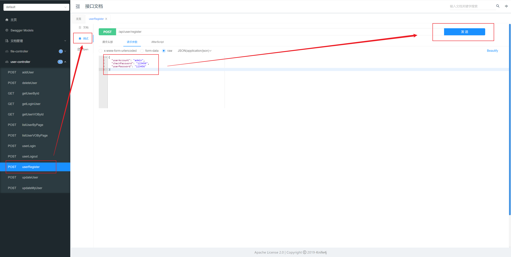
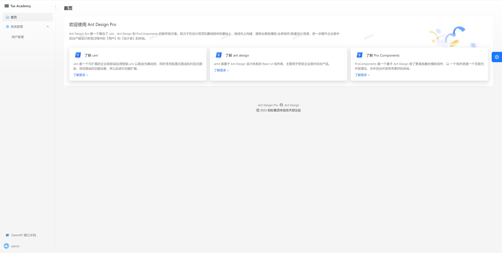

# 快速上手

### 后端项目

> 运行环境
>
> - IDEA
>
> - JDK 1.8
>
> - MySQL 8.0
>
> - Redis (可选)

1. 数据库初始化

   运行 api/sql/create_table.sql

2. 新建文件 api/src/main/resources/application-dev.yml

   复制以下配置，按照自己本地配置修改（Redis 和 Elastic Search 不用）

   ```yml
   # 公共配置文件
   spring:
     application:
       name: tax-academy
     # 支持 swagger3
     mvc:
       pathmatch:
         matching-strategy: ant_path_matcher
     # session 配置
     session:
       # todo 取消注释开启分布式 session（须先配置 Redis）
       # store-type: redis
       # 30 天过期
       timeout: 2592000
     # 数据库配置
     # todo 需替换配置
     datasource:
       driver-class-name: com.mysql.cj.jdbc.Driver
       url: jdbc:mysql://localhost:3306/tax_academy
       username: root
       password: 12345678
     # Redis 配置
     # todo 需替换配置，然后取消注释
     #  redis:
     #    database: 1
     #    host: localhost
     #    port: 6379
     #    timeout: 5000
     #    password: 123456
     # Elasticsearch 配置
     # todo 需替换配置，然后取消注释
     #  elasticsearch:
     #    uris: http://localhost:9200
     #    username: root
     #    password: 123456
     # 文件上传
     servlet:
       multipart:
         # 大小限制
         max-file-size: 10MB
   server:
     address: 0.0.0.0
     port: 8080
     servlet:
       context-path: /api
       # cookie 30 天过期
       session:
         cookie:
           max-age: 2592000
   mybatis-plus:
     configuration:
       map-underscore-to-camel-case: false
       log-impl: org.apache.ibatis.logging.stdout.StdOutImpl
     global-config:
       db-config:
         logic-delete-field: isDelete # 全局逻辑删除的实体字段名
         logic-delete-value: 1 # 逻辑已删除值（默认为 1）
         logic-not-delete-value: 0 # 逻辑未删除值（默认为 0）
   # 对象存储
   # todo 需替换配置
   cos:
     client:
       accessKey: xxx
       secretKey: xxx
       region: xxx
       bucket: xxx
   ```

3. 运行项目，创建用户，调试接口

   访问 http://localhost:8080/api/doc.html，使用 Swagger 调试接口，创建用户

   

   手动修改数据库，设置 `userRole` 为 admin


### 前端项目

> 运行环境
>
> - WebStorm / VsCode
> - React、TypeScript
> - Ant Design Pro 脚手架
> - Umi 框架
>
> - npm 包管理器

1. 安装 `node_modules`

   ```
   npm install
   ```

   或

   ```
   yarn
   ```

2. 启动项目

   ```
   npm start
   ```

   

